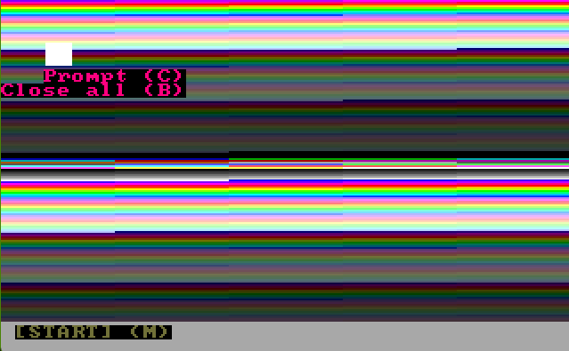

# MITOCHONDRIONOS.   

## System version

### 🌟 MitochondrionOS 1.0
Is some breaked  

### 🌟 MitochondrionOS 2.0
Have a comand for close programs [B]  

### 🌟 MitochondrionOS 2.1
We added a glitched cursor  

### 🌟 MitochondrionOS 3.0
We added a click system  

## HOW TO USE
B: close programs
N: notepad
C: Prompt comand
M: Start menu
Click in 'START' text to open Start Menu too
